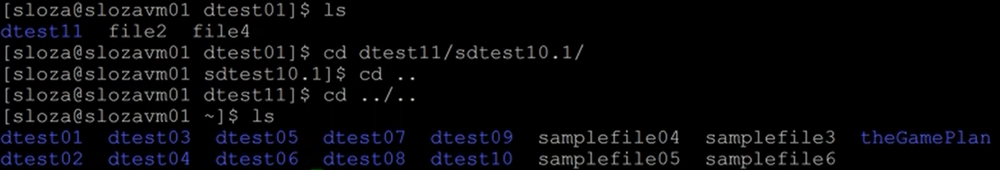
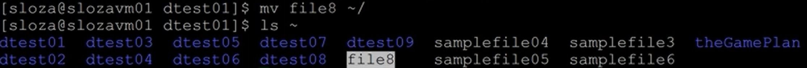

# Linux - Basic Commands & Navigation
---

[[toc]]

---
## All Commands
- `man` = manual
- `pwd` = print working directory
- `clear` = clear terminal
- `history` = show all previous commands
- `ls` = list current directory contents
- `tree` = indented tree view of current working directory
- `cd` = change directory
- `mkdir` = make directory
- `cat` = create or display file on terminal
- `touch` = create or update file
- `mv` = move or rename directory or file
- `rmdir` = remove empty directory
- `rm` = remove directory or file

---

KEEP THIS IN MIND

`~` = home directory = the directory you started your terminal session inside of

This can be used in all navigation, creation, deletion, and moving directory/file location commands because it is the path for the home directory.

---
## General Commands

### man
An interface to the online reference manuals

- type `man` and any other command to get the name, synopsis, description, options, and history of the command. This quickly will show what the command does, the available arguments, and what they can do.

  - ex. `man ls` shows the manual for what the `ls` command does.
  - you can even type `man man`
- this is a *highly* useful command; don't forget it!

### pwd
Print the full filename of the current working directory

### clear
Clears the terminal screen

### history
Shows the history of *all* commands typed in the current and previous sessions

---
## Commands to View Directory Contents

### ls
List directory contents

- type `ls` to show a list of directories and files in the current directory (folder). Directories will be written in blue and files will be white.

- `ls -a` = includes *hidden* directories and files in the original list. These hidden objects will have a `.` before them, such as `.ssh`
- `ls -l` = writes the list in a 'long listing' format, which will include seven columns.
- `ls -h` = prints the list as human-readable
- `ls -R` = shows all the files not only in directories but also in subdirectories
- `ls -r` = reverse order while sorting
- `ls -t` = sort by modification time, newest first

{#id-fig1}

Arguments such as `-a`, `-l`, etc., can be written together like `-la` to show a long listing format including hidden items (in this example).

### tree
List contents of directories in a tree-like format

- `tree` operates very similarly to `ls -R` but gives an indented tree visualization from the current directory 

- If you are in the home (`~`) directory when using `tree`, you will see all directories & files; depending on the size of your system, this can be quite unwieldly. It is recommended to either navigate to the subdirectory of interest and type `tree` (as shown above), or do something similar to the following:
  - ex. `tree dtest01/dtest02` will only show a tree view of the `dtest02` directory rather than the current working directory
- `tree` can be used with arguments like `-t`, `-a`, etc.
- `tree -d` shows directories only (useful if viewing hierarchies with large quantities of data)
- `tree -L [level]` where *level* is the max display depth of the directory tree

---
## Command to Navigate Directories

### cd
Change the current directory

- `cd [directory_path]` is used to *navigate* between directories, either up or down

  - ex. `cd dtest01/` takes you to the `dtest01` directory
  - ex. `cd dtest01/dtest02/dtest03` navigates all the way to the `dtest03` directory
- ex. `cd ..` or `cd ../` takes you up one directory
  - ex. `cd ../..` or `cd ../../` takes you up two directories (additional `/..` can be applied to go up any number of directories)
- ex. `cd ~` takes you to the *Home* directory (again, designated as `~`)
  - ex. `cd ~/[directory_path]` will allow you to directory navigate from the home directory down the given path, regardless which directory you are currently in

---
## Commands to Make Directories and Files

### mkdir
Make directories

- `mkdir [dirName]` makes a new directory named `[dirName]`

  - ex. `mkdir dtest01` makes a directory called `dtest01`
- `mkdir -p` allows you to make parent directories as needed
  - ex. `mkdir dtest01/dtest02/dtest03` would go into the previously created `dtest01` directory, make a new directory called `dtest02`, then finally make a new directory called `dtest03`
- `mkdir` can create any number of directories, whether a chain of directories (requiring `-p`) or in the current working directory
  - ex. `mkdir -p dtest11/dtest12/dtest13 dtest21/dtest22 dtest31` would create 3 directories in the current working directory, 2 of which would then have nested directories

### cat
Concatenate files and print on the standard output

- `cat [file_name]` prints the contents of a `[file_name]` to the terminal

- `cat > [file_name]` creates a txt file called `[file_name]` and enables you to immediately add text content from the terminal. CTRL + D is used to exit this text editing mode.
  - be careful with this since writing `cat > [file_name]` will *erase* the contents of `[file_name]` and prompt you to begin writing from an empty file
- `cat file01 file02` will display the full contents of `file01` and then the full contents of `file02`
- `cat file01 file02 > file03` will create a file named `file03` composed of the full contents of `file01` and then the full contents of `file02`

### touch
Change file access and modification timestamps to the current time - if no file exists, an empty file is created

- `touch` can create a file similar to `cat`, but does not give the option to edit the file (nor can it display the file to the terminal)

- `touch -a` changes only the access time
- `touch -m` changes only the modification time

## Command to Move & Rename Directories & Files
---
### mv
Move (rename) files - rename SOURCE to DEST, or move SOURCE(s) to DIRECTORY

- `mv [object_name] [object_name2]` will rename `[object_name]` to `[object_name2]`, where the object can be either a file or directory

- `mv [object_name] /[directory_path]` will move the object from the current working directory to the designated subdirectory
  - Note: you can also use `~/[directory_path]` to access any directory, not just subdirectories. Likewise, `../` can be used to move the object up one directory level 

 

---
## Commands to Remove Directories and Files

### rmdir
Remove *empty* directories

- `rmdir [dName]` removes the directory `[dName]` *IF* `[dName]` is empty

- Very similar to `mkdir`, `rmdir` can use `-p` as well to remove entire directory hierarchies
  - ex. `rmdir -p a/b/c` is equivalent to `rmdir a/b/c a/b a`
- This is a significantly safer method than using the standard `rm` if deleting several directories since it won't accidentally delete directories with files or other directories inside of them

### rm
Remove files or directories

- `rm [file_name]` removes the file `[file_name]` 

- `rm -d` remove empty directories (same as `rmdir`)
- `rm -r` or `rm -R` remove directories and their contents recursively
- `rm -i` prompt before every removal
- `rm -I` prompt a single time before removing more than three files, or when  removing recursively; less intrusive than `-i`, while still giving protection against most mistakes
