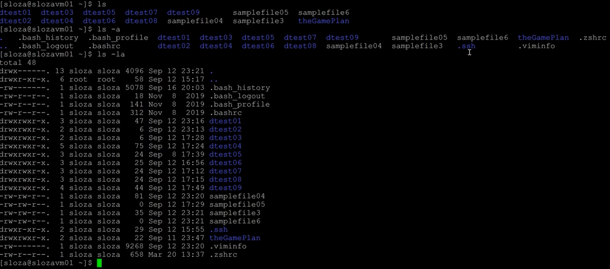

# Linux - Basic Commands & Navigation
---
## All Commands
 - `ls`
 - `tree`
 - `man`
 - `mkdir`
 - `clear`
 - `cd`
 - `rmdir`
 - `cat`
 - `rm`
 - `mv`
 - `history`
---
- `man`
- `clear`
- `history`
- `ls`
- `tree`
- `cd`
- `mkdir`
- `cat`
- `touch`
- `mv`
- `rmdir`
- `rm`

---

KEEP THIS IN MIND

`~` = home directory = the directory you started your terminal session inside of

This can be used in all navigation, creation, deletion, and moving directory/file location commands because it is the path for the home directory.

---

## General Commands

### man
An interface to the online reference manuals

- type `man` and any other command to get the name, synopsis, description, options, and history of the command. This quickly will show what the command does, the available arguments, and what they can do.
  - ex. `man ls` shows the manual for what the `ls` command does.
  - you can even type `man man`
- this is a *highly* useful command; don't forget it!

### clear
Clears the terminal screen

### history
Shows the history of *all* commands typed in the current and previous sessions

## Commands to View

### ls
List directory contents

- type `ls` to show a list of directories and files in the current directory (folder). Directories will be written in blue and files will be white.
- `ls -a` = includes *hidden* directories and files in the original list. These hidden objects will have a `.` before them, such as `.ssh`
- `ls -l` = writes the list in a 'long listing' format, which will include seven columns.
- `ls -h` = prints the list as human-readable
- `ls -R` = shows all the files not only in directories but also in subdirectories
- `ls -r` = reverse order while sorting
- `ls -t` = sort by modification time, newest first

Arguments such as `-a`, `-l`, etc., can be written together like `-la` to show a long listing format including hidden items (in this example).

### tree
List contents of directories in a tree-like format

- `tree` operates very similarly to `ls -R` but gives an indented tree visualization
- `tree` can be used with arguments like `-t`, `-a`, etc.
- `tree -d` shows directories only (useful if viewing hierarchies with large quantities of data)
- `tree -L [level]` where *level* is the max display depth of the directory tree

### cd
Change the current directory

- `cd [directory_path]` is used to *navigate* between directories, either up or down
  - ex. `cd dtest01/` takes you to the `dtest01` directory
  - ex. `cd dtest01/dtest02/dtest03` navigates all the way to the `dtest03` directory
- ex. `cd ..` or `cd ../` take you up one directory
  - ex. `cd ../..` or `cd ../../` take you up two directories
- ex. `cd ~` takes you to the *Home* directory
  - ex. `cd ~/[directory_path]` will allow you to directory navigate from the home directory down the given path, regardless which directory you are currently in

### mkdir

### cat
### touch
### mv
### rmdir
### rm
